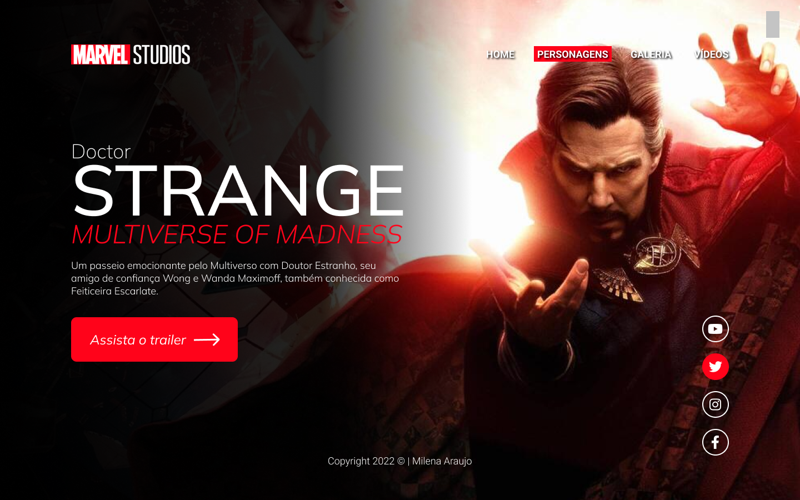
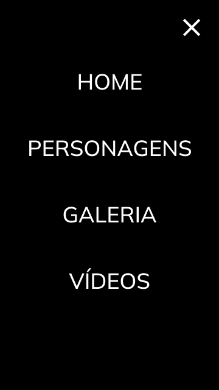

# Doctor Stranger
Projeto construído durante as aulas de LIMA, no curso de desenvolvimento de sistemas do [SENAI Jandira](https://jandira.sp.senai.br/), com orientação do Prof.[Fernando Leonid](https://github.com/fernandoleonid)

---

## Qual era o objetivo do projeto?
O objetivo era criar uma landing page com base no design feito no figma, aprendendo a estrutura do HTML, CSS e JS e conceitos de responsividade.

---

## O que é uma Landing Page?
Landing Page são páginas com foco principal na conversão de visitantes, assim, essas páginas possuem uma estética mais minimalista comparada com os sites tradicionais.

---

## Tecnologias usadas
- HTML 5
- CSS 3
- Javascript
- Figma

---

## Links
- [Resultado](https://miharaujo.github.io/Figma-Doctor-Stranger/)
- [Projeto no Figma](https://www.figma.com/file/oW8Hgf009VbuN9lOBChhLi/LIMA---STRANGE2?node-id=0%3A1)
- [Código](https://github.com/MihAraujo/Figma-Doctor-Stranger)

---

## Autor
[Milena Araujo](https://github.com/MihAraujo)

- Cursando Ensino Médio e Técnico de Desenvolvimento de Sistemas (SENAI Jandira)